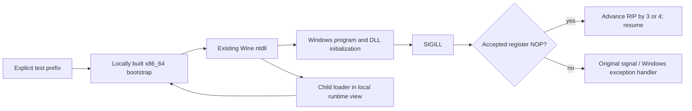

# Architecture and extension criteria

The bridge interposes libc `sigaction` from a Mach-O dylib. Each registration
gets an immutable downstream handler and a dedicated trampoline. Returned
handler queries expose the original logical action. Emulating a NOP does not
consume SA_RESETHAND; an actual forwarded exception does. Unknown synchronous
faults with a default handler retain normal SIGILL termination.

Instruction reads are bounded Mach reads, first three bytes and a fourth only
for a supported prefix. No target-memory writes, disassembly of whole
modules, dynamic code patching or allocation occurs in the handler. The
counter uses lock-free atomics. Optional trace writes can be expensive.

The bootstrap reserves Wine-compatible regions via zero-fill Mach-O segments,
maps those reservations PROT_NONE, opens the selected existing ntdll.so, and
calls its published loader entry. It runs as x86_64 and does not request the
ARM64 4KB-layout entitlement investigated in the earlier FEX work.

Before extending the accepted instruction set, add an architecture reference,
an independent executable reproducer, before/after context checks, negative
controls, and an integration check. Do not turn unknown faults into generic
instruction skipping. A graphics-sharing implementation would require its
own resource lifetime, synchronization and content-correctness tests.

The API is experimental: 32 SIGILL registration slots, no library unloading,
no proof of 32-bit execution correctness or compatibility with raw system-call
handler changes. This is not a production substitute for changes in an
instruction translator or Wine upstream.

## Privileged faults

The optional `NOP_BRIDGE_PRIVILEGED=1` path recognizes valid register-form
MOV CR0/CR2/CR3/CR4/CR8 instructions, including supported REX encodings. When
Rosetta reports Darwin trap 6, the bridge changes the exception metadata to
trap 13 with zero error code, preserving RIP and register values. Wine then
dispatches `EXCEPTION_PRIV_INSTRUCTION`, as user-mode execution requires.
The downstream handler decides what to do. The bridge does not execute or
skip the privileged operation. Undefined control registers and UD2 retain
illegal-instruction classification.

## Wine module overlay

The pinned-source builder applies reviewable patches and builds three PE
modules, a minimal Wine system-process executable, and ntdll's Unix half.
`prepare_runtime.py --modules` copies those into a new local runtime view
while linking unchanged components to the existing installation, and fails
loudly if the built `ntdll.so` is not x86_64. No driver or game image is
rewritten. `docs/APPLIED-TECHNIQUES.md` lists exactly which files that view
replaces, and the evidence for each of them.

The kernel changes provide actual synchronization, object-name lifetime,
callback-list ownership, and caller-owned memory-range arrays. Their limits
are explicit: Wine's guarded-region/APC semantics and crash-dump machinery
remain incomplete, and the reported logical physical span is not a mapping
of host physical memory.

Media experiments are opt-in capability fallbacks. They neither produce
fake shared handles nor claim to implement cross-device resource sharing.
Successful software decoding in the independent probe requires an application
that supports CPU frames; Unity's response must be verified separately.

## September update

Patch order is kernel, thread-owner, September update, ACE kernel exports,
ACE extended exports, ACE CORE driver stubs, the kernel-mode Rosetta NOP fix,
the user-mode Rosetta NOP fix, then media fallback. The order is load-bearing:
each patch is generated against the files as the previous ones left them, so
the NOP patches in particular must stay after `september-update`, which also
touches `instr.c`. The historical `thread-process-experimental` filename
remains for provenance; its implementation is now part of the default build. DW-Proton contributions
and local changes are itemized in THIRD_PARTY.md.

The memory mapping layer retains a mapped section view while an MDL references
it and delays unmapping until the last retained mapping is released. It remains
a Wine user-space model, not host physical-memory access. Process exit status
and user-thread context come from actual queried objects. Unsupported requests
remain failures.

The driver-entry compatibility shim places the entry return address in the
upper canonical range and converts matching address faults back into Wine's
user-space address model. This broad upstream exception translation is not a
complete guest kernel or interrupt backend. The `lsass.exe` Wine component
registers as a system process and waits for shutdown; it provides no Windows
security-service implementation. Installation copies it and adds a RunServices
entry only in a stopped, cloned bottle.
